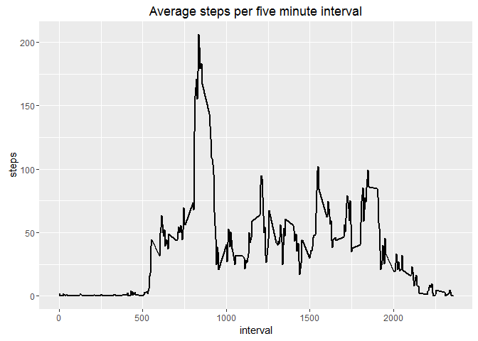
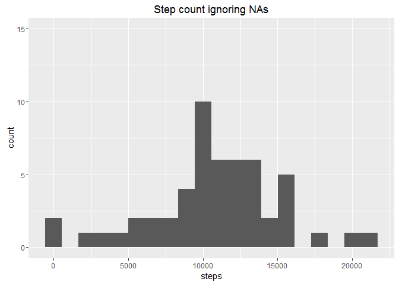
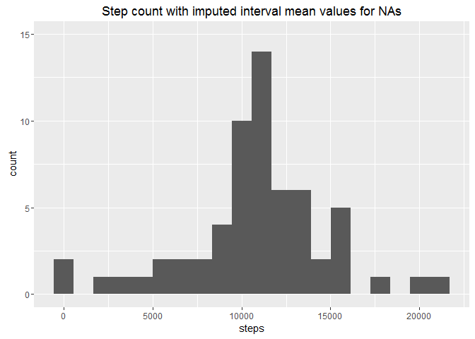
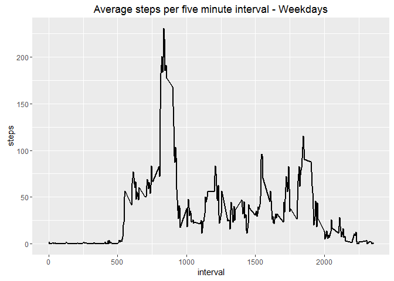
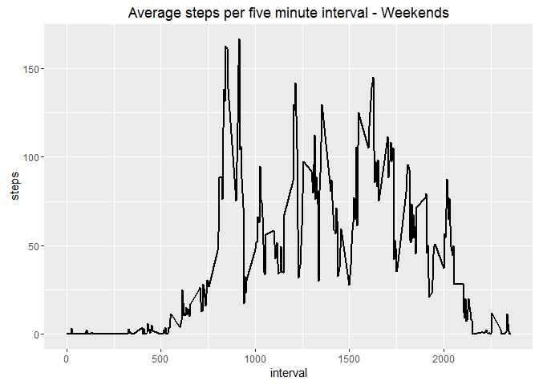

### Introduction

It is now possible to collect a large amount of data about personal
movement using activity monitoring devices such as a Fitbit, Nike
Fuelband, or Jawbone Up. These type of devices are part of the
"quantified self" movement - a group of enthusiasts who take
measurements about themselves regularly to improve their health, to find
patterns in their behavior, or because they are tech geeks. But these
data remain under-utilized both because the raw data are hard to obtain
and there is a lack of statistical methods and software for processing
and interpreting the data.

This assignment makes use of data from a personal activity monitoring
device. This device collects data at 5 minute intervals through out the
day. The data consists of two months of data from an anonymous
individual collected during the months of October and November, 2012 and
include the number of steps taken in 5 minute intervals each day.

### Load dplyr and ggplot2 packages

-   if these packages have not been installed, they can be installed
    using the install.packages command.

<!-- -->

    library(ggplot2)
    library(dplyr)

### Load data set

-   The data for this assignment can be downloaded from the course web
    site:
    <https://d396qusza40orc.cloudfront.net/repdata%2Fdata%2Factivity.zip>.
-   Data will be stored in the activity dataframe, and dataframes
    derived from activity.

<!-- -->

    ## Clear variables in memory
    rm(list=ls())

    ## Download data and store to activity dataframe
    myurl <- "https://d396qusza40orc.cloudfront.net/repdata%2Fdata%2Factivity.zip"
    download.file(myurl, destfile='activity.zip')
    unzip("activity.zip")
    activity <- read.csv(file="activity.csv", header=TRUE, sep=",")

### Review data structure

    head(activity)

    ##   steps       date interval
    ## 1    NA 2012-10-01        0
    ## 2    NA 2012-10-01        5
    ## 3    NA 2012-10-01       10
    ## 4    NA 2012-10-01       15
    ## 5    NA 2012-10-01       20
    ## 6    NA 2012-10-01       25

    tail(activity)

    ##       steps       date interval
    ## 17563    NA 2012-11-30     2330
    ## 17564    NA 2012-11-30     2335
    ## 17565    NA 2012-11-30     2340
    ## 17566    NA 2012-11-30     2345
    ## 17567    NA 2012-11-30     2350
    ## 17568    NA 2012-11-30     2355

    summary(activity)

    ##      steps                date          interval     
    ##  Min.   :  0.00   2012-10-01:  288   Min.   :   0.0  
    ##  1st Qu.:  0.00   2012-10-02:  288   1st Qu.: 588.8  
    ##  Median :  0.00   2012-10-03:  288   Median :1177.5  
    ##  Mean   : 37.38   2012-10-04:  288   Mean   :1177.5  
    ##  3rd Qu.: 12.00   2012-10-05:  288   3rd Qu.:1766.2  
    ##  Max.   :806.00   2012-10-06:  288   Max.   :2355.0  
    ##  NA's   :2304     (Other)   :15840

    str(activity)

    ## 'data.frame':    17568 obs. of  3 variables:
    ##  $ steps   : int  NA NA NA NA NA NA NA NA NA NA ...
    ##  $ date    : Factor w/ 61 levels "2012-10-01","2012-10-02",..: 1 1 1 1 1 1 1 1 1 1 ...
    ##  $ interval: int  0 5 10 15 20 25 30 35 40 45 ...

### Convert Dates and Remove NA values

-   convert date column from factor to date data type
-   Remove rows with steps == NA and store to activityNA
-   Review summary

<!-- -->

    activity$date <- as.Date(activity$date)
    activityNA <- na.omit(activity)
    summary(activityNA)

    ##      steps             date               interval     
    ##  Min.   :  0.00   Min.   :2012-10-02   Min.   :   0.0  
    ##  1st Qu.:  0.00   1st Qu.:2012-10-16   1st Qu.: 588.8  
    ##  Median :  0.00   Median :2012-10-29   Median :1177.5  
    ##  Mean   : 37.38   Mean   :2012-10-30   Mean   :1177.5  
    ##  3rd Qu.: 12.00   3rd Qu.:2012-11-16   3rd Qu.:1766.2  
    ##  Max.   :806.00   Max.   :2012-11-29   Max.   :2355.0

### Sum steps by date, plot as histogram and calculate mean and median

-   Use dplyr to create a dataframe containing the sum of steps by date
-   use ggplot2 qplot function to plot histogram of the step count
    frequency across all dates
-   calculate mean and median daily steps

<!-- -->

    activitySum <- activityNA %>% group_by(date) %>% summarize(steps = sum(steps))

    qplot(steps, data = activitySum, bins = 20)

    mean(activitySum$steps)

    ## [1] 10766.19

    median(activitySum$steps)

    ## [1] 10765

### Line plot of average steps per five minute interval

-   Interval 500 = 5:00AM etc

<!-- -->

    activityMean <- activityNA %>% group_by(interval) %>% summarize(steps = mean(steps))
    g <- ggplot(data = activityMean, aes(x = interval, y = steps))
    g <- g + geom_line(size=1)
    g <- g + ggtitle("Average steps per five minute interval")
    g

### Show interval with the highest average step count

-   Maximum average steps by interval are ~ 206 at 8:35 AM

<!-- -->

    filter(activityMean, steps == max(steps))

    ## Source: local data frame [1 x 2]
    ## 
    ##   interval    steps
    ##      <int>    <dbl>
    ## 1      835 206.1698

### Impute missing data

-   To adjust for missing step count data, we will assign the average
    number of steps for an interval in cases the number of steps for the
    interval is NA
-   We will create a combined dataframe, activityImp combining the
    activity dataframe, with the activityMean dataframe
-   Relabel the column names in activityImp for clarity
-   We will substitute the mean interval step count in activityImp for
    steps where steps in activityImp = NA

<!-- -->

    activityImp <- merge(activity, activityMean, by = "interval")
    colnames(activityImp) <- c("interval", "steps", "date", "mean")
    activityImp$steps[is.na(activityImp$steps)] <- activityImp$mean[is.na(activityImp$steps)]

### Sum steps by date, plot as histogram and calculate mean and median using the imputed data set

-   Derive dataframe with sum of daily steps
-   Plot histogram
-   calculate mean and median daily steps

<!-- -->

    activitySumImp <- activityImp %>% group_by(date) %>% summarize(steps = sum(steps))

    qplot(steps, data = activitySum, bins = 20, main = "Step count ignoring NAs", ylim = c(0,15))

    qplot(steps, data = activitySumImp, bins = 20, main = "Step count with imputed interval mean values for NAs", ylim = c(0,15))

    mean(activitySumImp$steps)

    ## [1] 10766.19

    median(activitySumImp$steps)

    ## [1] 10766.19

-   The mean values are the same, but the median value in the imputed
    data set is higher and now equal to the mean
-   As seen from the histograms, the number of days with average step
    count is notably higher after adding the imputed values.

### Are there differences in activity patterns between weekdays and weekends?

-   Using the imputed dataframe, add factor variable with two levels
    "weekday" and "weekend"
-   create filtered data frames of interval steps counts grouping by
    weekday and weekend

<!-- -->

    activityW <- mutate(activityImp, weekpart = ifelse(weekdays(activityImp$date) =="Saturday" | weekdays(activityImp$date)=="Sunday", "weekend", "weekday"))

    activityWE <- filter(activityW, weekpart == "weekend") %>% group_by(interval) %>% summarize(steps = mean(steps))

    activityWD <- filter(activityW, weekpart == "weekday") %>% group_by(interval) %>% summarize(steps = mean(steps))

-   create panel time series plots for the average interval counts for
    weekdays and for weekends.

<!-- -->

    par(mfrow=c(2,1))

    g <- ggplot(data = activityMean, aes(x = interval, y = steps))
    g <- g + geom_line(size=1)
    g <- g + ggtitle("Average steps per five minute interval")
    g

    g <- ggplot(data = activityMean, aes(x = interval, y = steps))
    g <- g + geom_line(size=1)
    g <- g + ggtitle("Average steps per five minute interval")
    g

